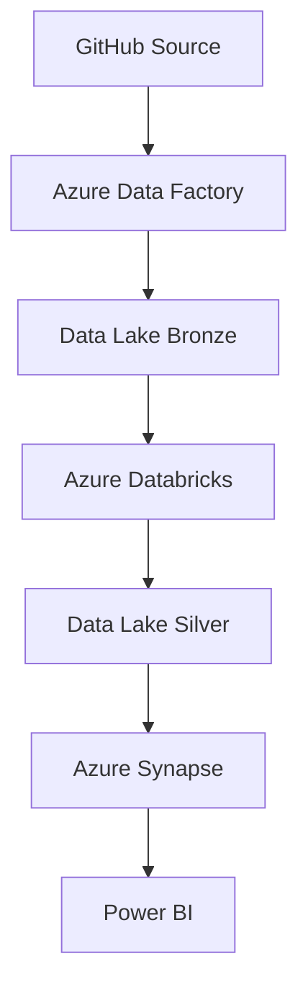

# Adventure Works Data Engineering Project

## 📊 Overview

This project implements a comprehensive data engineering pipeline for Adventure Works dataset using Microsoft Azure cloud services. The pipeline follows a medallion architecture pattern (Bronze → Silver → Gold) to process raw data through various transformation stages, ultimately delivering business-ready analytics through Power BI dashboards.

## 🏗️ Architecture

The pipeline consists of three main layers:

### 🥉 Bronze Layer (Raw Data Ingestion)

**Dataset:** [Adventure Works Dataset](https://www.kaggle.com/datasets/ukveteran/adventure-works/data) 

- **Source**: GitHub repository containing Adventure Works datasets
- **Tool**: Azure Data Factory (ADF)
- **Process**: Dynamic data ingestion using HTTP connector
- **Components**:
  - **Lookup Activity**: Identifies available datasets and metadata
  - **ForEach Activity**: Iterates through multiple data sources
  - **Copy Data Activity**: Transfers data from GitHub to Azure Data Lake
- **Storage**: Azure Data Lake Gen2 (CSV format)
- **Purpose**: Stores raw, unprocessed data exactly as received from source

### 🥈 Silver Layer (Data Transformation)
- **Tool**: Azure Databricks
- **Process**: Data cleaning, transformation, and enrichment using PySpark
- **Features**:
  - Data quality validations
  - Schema standardization
  - Data type conversions
  - Basic data visualizations for quality assessment
- **Storage**: Azure Data Lake Gen2 (Parquet format)
- **Purpose**: Provides cleaned and structured data ready for analytics

### 🥇 Gold Layer (Data Serving)
- **Tool**: Azure Synapse Analytics
- **Process**: Creates analytical views and external tables
- **Components**:
  - **External Data Source**: References Silver layer data
  - **External File Format**: Defines Parquet file structure
  - **Credentials**: Manages secure access to data lake
  - **Views**: Uses OPENROWSET for flexible data access
- **Purpose**: Serves business-ready data for reporting and analytics

## 🔧 Technologies Used

| Layer | Technology | Purpose |
|-------|------------|---------|
| **Orchestration** | Azure Data Factory | Pipeline orchestration and data movement |
| **Storage** | Azure Data Lake Gen2 | Scalable data storage across all layers |
| **Processing** | Azure Databricks | Data transformation using PySpark |
| **Analytics** | Azure Synapse Analytics | Data warehousing and SQL analytics |
| **Visualization** | Power BI | Business intelligence and reporting |
| **Source Control** | GitHub | Version control and source data hosting |

## 📈 Key Features

### Dynamic Data Ingestion
- **Metadata-driven approach**: Uses Lookup activities to dynamically identify data sources
- **Scalable processing**: ForEach loops handle multiple datasets efficiently
- **Error handling**: Robust error management and retry mechanisms

### Data Transformation Pipeline
- **PySpark processing**: Leverages distributed computing for large-scale data processing
- **Data quality checks**: Implements validation rules and data profiling
- **Performance optimization**: Uses Parquet format for improved query performance

### Analytical Layer
- **External tables**: Enables SQL-based analytics without data movement
- **Security**: Implements proper authentication and authorization
- **Flexibility**: OPENROWSET allows ad-hoc querying capabilities

## 📊 Data Flow

## 🔍 Monitoring and Maintenance

### Data Factory Monitoring
- Pipeline run history and performance metrics
- Data movement monitoring
- Error tracking and alerting

### Databricks Monitoring
- Cluster utilization and performance
- Job execution monitoring
- Cost optimization recommendations

### Synapse Analytics
- Query performance monitoring
- Resource utilization tracking
- Security and compliance monitoring
